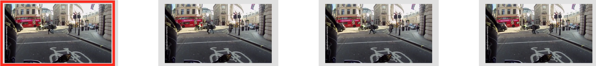

# video localization

Localize (get index) a frame in a video. Used to find out where you are from a single image, or a short sequence.


This can be used in augmented reality applications to localize a user in one of multiple locations.





## Library

`vloc.py` is a library to process and parse videos:

- create embedding of a video
- localize in video 
- summarize a video (ignore similar frames)

## What is needed:

- a video of a location (video1)
- a caption file for the video that links locations to objects (this can be obtained automatically by recognizing nearby objects)
- a second video in same location to test/demo (video2)


## How to use it?

Usage is: have required files, have another set of files or movie to run a test/demo on (a second video in same location).


### Parse and pre-process videos:

This code takes an input video and computes embedding for every frames of the video.

You can then input a frame of another or same video, and it will tell you which frames are most similar to the one you presented.

Run as: ```python3 vloc.py -i video1.mp4```

This will save a embedding file `video1.mp4.emb.npy` that saves embeddings of each frame of video1 used for localization.


### Demo:

The demo will take a caption file and a video input to label all object in each frame of the video.

```python3 demo.py -c video1.srt -i video2.mp4```


Show closest frames in a video to selected frame in same video:

```python3 vloc.py -i video1.mp4 --queryf 400```

Summarize a video:

```python3 vloc.py -i video.mp4 --summarize True```